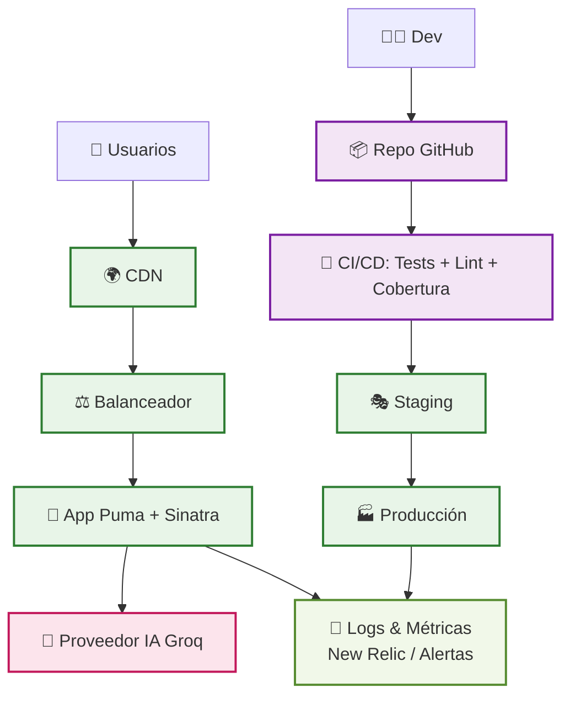

# Arquitectura de Despliegue - Aplicación Horóscopo

## Diagrama de Arquitectura de Despliegue

```mermaid
graph TD
  U[👥 Usuarios] --> CDN[🌍 CDN]
  CDN --> LB[⚖️ Balanceador]
  LB --> APP[🚀 App Puma + Sinatra]
  APP --> IA[🤖 Proveedor IA Groq]
  APP --> LOG[📝 Logs & Métricas<br/>New Relic / Alertas]

  DEV[👨‍💻 Dev] --> GIT[📦 Repo GitHub]
  GIT --> CI[🔄 CI/CD: Tests + Lint + Cobertura]
  CI --> STG[🎭 Staging]
  STG --> PROD[🏭 Producción]
  PROD --> LOG

  classDef infra fill:#e8f5e8,stroke:#2e7d32,stroke-width:2px
  classDef cicd fill:#f3e5f5,stroke:#7b1fa2,stroke-width:2px
  classDef ext fill:#fce4ec,stroke:#c2185b,stroke-width:2px
  classDef mon fill:#f1f8e9,stroke:#558b2f,stroke-width:2px

  CDN:::infra
  LB:::infra
  APP:::infra
  PROD:::infra
  STG:::infra
  IA:::ext
  LOG:::mon
  GIT:::cicd
  CI:::cicd
```
