# Arquitectura de Despliegue - Aplicación Horóscopo

## Diagrama de Arquitectura de Despliegue

```mermaid
graph TB
 subgraph subGraph0["👥 Usuarios"]
        USER["👤 Usuario Final"]
        DEV["👨‍💻 Desarrollador"]
        OPS["⚙️ DevOps/SRE"]
  end
 subgraph subGraph1["🏗️ Construcción y Pruebas"]
        UNIT["🧪 Pruebas Unitarias<br>RSpec"]
        BROWSER["🌐 Pruebas de Navegador<br>Capybara + Selenium"]
        SMOKE["💨 Pruebas de Humo<br>Validación Rápida"]
        COV["📊 Cobertura<br>SimpleCov + SonarQube"]
  end
 subgraph subGraph2["🚀 Etapas de Despliegue"]
        STAGING["🎭 Entorno de Pruebas"]
        PROD["🏭 Entorno de Producción"]
  end
 subgraph subGraph3["🔄 Pipeline CI/CD"]
        GIT["📦 Repositorio Git<br>GitHub/GitLab"]
        subGraph1
        subGraph2
  end
 subgraph subGraph4["🌐 CDN y Balanceador"]
        CDN["🌍 CDN<br>Recursos Estáticos"]
        LB["⚖️ Balanceador de Carga"]
  end
 subgraph subGraph5["🖥️ Servidores de Aplicación"]
        APP1["🚀 Servidor App 1<br>Puma + Sinatra"]
        APP2["🚀 Servidor App 2<br>Puma + Sinatra"]
  end
 subgraph subGraph6["🔌 Servicios Externos"]
        OPENAI["🤖 API Groq AI<br>Integración GPT"]
        NEWRELIC["📈 New Relic<br>Monitoreo APM"]
  end
 subgraph subGraph7["📊 Monitoreo y Registros"]
        LOGS["📝 Registros de Aplicación"]
        METRICS["📊 Métricas de Rendimiento"]
        ALERTS["🚨 Sistema de Alertas"]
  end
 subgraph subGraph8["☁️ Infraestructura en la Nube"]
        subGraph4
        subGraph5
        subGraph6
        subGraph7
  end
 subgraph subGraph9["🏠 Pruebas Locales"]
        LOCAL_UNIT["Pruebas Unitarias"]
        LOCAL_BROWSER["Pruebas de Navegador<br>APIs Simuladas"]
        LOCAL_SMOKE["Pruebas de Humo<br>App Local"]
  end
 subgraph subGraph10["☁️ Pruebas Remotas"]
        REMOTE_BROWSER["Pruebas de Navegador<br>Entorno Real"]
        REMOTE_SMOKE["Pruebas de Humo<br>App Desplegada"]
        E2E["Pruebas Extremo a Extremo<br>Tipo Producción"]
  end
 subgraph subGraph11["🧪 Infraestructura de Pruebas"]
        subGraph9
        subGraph10
  end
    USER --> CDN
    CDN --> LB
    LB --> APP1 & APP2 & APP3
    APP1 --> OPENAI & NEWRELIC & LOGS
    APP2 --> OPENAI & NEWRELIC & LOGS
    APP3 --> OPENAI & NEWRELIC & LOGS
    DEV --> GIT
    GIT --> UNIT & BROWSER & SMOKE & LINT["LINT"] & COV
    UNIT --> STAGING
    BROWSER --> STAGING
    SMOKE --> STAGING
    LINT --> STAGING
    COV --> STAGING
    STAGING --> REMOTE_SMOKE
    REMOTE_SMOKE --> PROD & STAGING & PROD
    OPS --> STAGING & PROD
    PROD --> METRICS
    METRICS --> ALERTS
    ALERTS --> OPS
    LOCAL_UNIT -.-> APP1
    LOCAL_BROWSER -.-> APP1
    LOCAL_SMOKE -.-> APP1
    REMOTE_BROWSER --> STAGING & PROD
    E2E --> PROD
     USER:::userClass
     DEV:::userClass
     OPS:::userClass
     UNIT:::cicdClass
     BROWSER:::cicdClass
     SMOKE:::cicdClass
     COV:::cicdClass
     STAGING:::cicdClass
     PROD:::cicdClass
     GIT:::cicdClass
     CDN:::appClass
     LB:::appClass
     APP1:::appClass
     APP2:::appClass
     APP3:::appClass
     OPENAI:::extClass
     NEWRELIC:::extClass
     LOGS:::monClass
     METRICS:::monClass
     ALERTS:::monClass
     LOCAL_UNIT:::testClass
     LOCAL_BROWSER:::testClass
     LOCAL_SMOKE:::testClass
     REMOTE_BROWSER:::testClass
     REMOTE_SMOKE:::testClass
     E2E:::testClass
     LINT:::cicdClass
    classDef userClass fill:#e1f5fe,stroke:#0277bd,stroke-width:2px
    classDef cicdClass fill:#f3e5f5,stroke:#7b1fa2,stroke-width:2px
    classDef appClass fill:#e8f5e8,stroke:#2e7d32,stroke-width:2px
    classDef testClass fill:#fff3e0,stroke:#ef6c00,stroke-width:2px
    classDef extClass fill:#fce4ec,stroke:#c2185b,stroke-width:2px
    classDef monClass fill:#f1f8e9,stroke:#558b2f,stroke-width:2px
```

## Componentes de la Arquitectura

### 🏗️ **Capa de Aplicación**
- **Framework**: Sinatra (Ruby)
- **Servidor Web**: Puma
- **Balanceador de Carga**: Distribución de tráfico
- **CDN**: Entrega de contenido estático optimizada

### 🧪 **Estrategia de Pruebas**
- **Pruebas Unitarias**: RSpec para lógica de negocio
- **Pruebas de Navegador**: Capybara + Selenium para interfaz de usuario
- **Pruebas de Humo**: Validación rápida post-despliegue
- **Pruebas Remotas**: Validación en entornos reales

### 🔄 **Pipeline CI/CD**
- **Calidad de Código**: RuboCop para estándares de código
- **Cobertura**: SimpleCov + SonarQube para métricas
- **Entorno de Pruebas**: Validación pre-producción
- **Producción**: Despliegue con validación automática

### 🔌 **Servicios Externos**
- **API OpenAI**: Generación de horóscopos
- **New Relic**: Monitoreo de rendimiento (APM)

### 📊 **Monitoreo y Observabilidad**
- **Registros de Aplicación**: Registro de eventos y errores
- **Métricas de Rendimiento**: Métricas de rendimiento en tiempo real
- **Sistema de Alertas**: Notificaciones automáticas de incidentes

## 🚀 **Flujo de Despliegue**

1. **Desarrollo** → Commit al repositorio
2. **Pipeline CI** → Ejecución de pruebas y validaciones
3. **Entorno de Pruebas** → Despliegue en entorno de staging
4. **Pruebas de Humo** → Validación rápida del despliegue
5. **Producción** → Despliegue en producción
6. **Monitoreo** → Monitoreo continuo y alertas

## 🔒 **Consideraciones de Seguridad**
- **SSL/TLS**: Terminación SSL en el balanceador
- **Rack::Protection**: Protección contra ataques comunes
- **Variables de Entorno**: Gestión segura de secretos
- **Protección CSRF**: Protección contra ataques CSRF

## 📈 **Escalabilidad**
- **Escalado Horizontal**: Múltiples instancias de aplicación
- **Balanceador de Carga**: Distribución eficiente del tráfico
- **CDN**: Optimización de entrega de contenido
- **Monitoreo**: Observabilidad para decisiones de escalado
